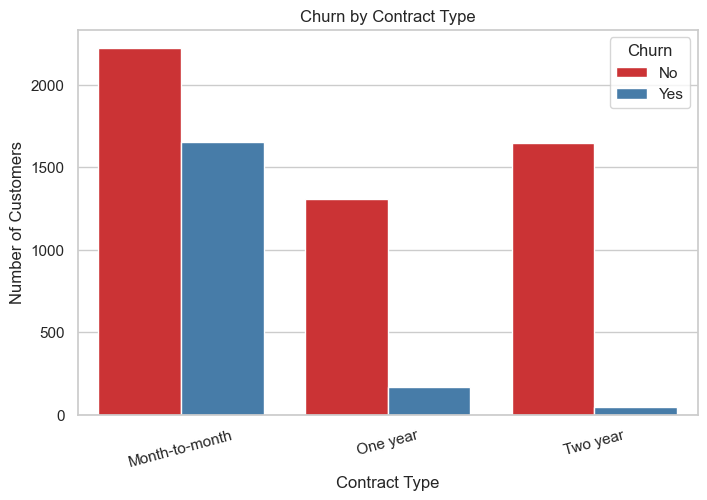
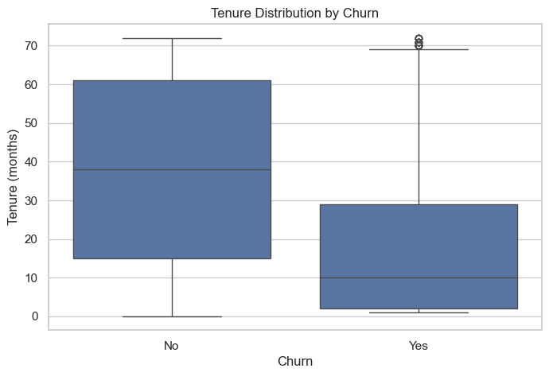
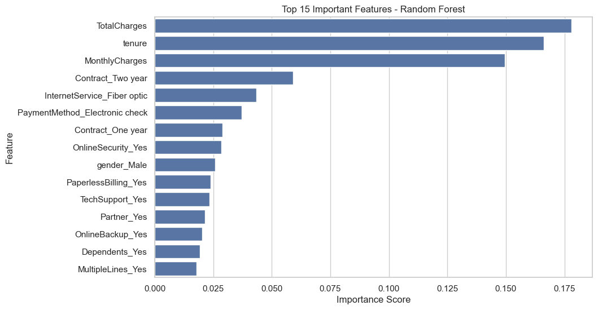
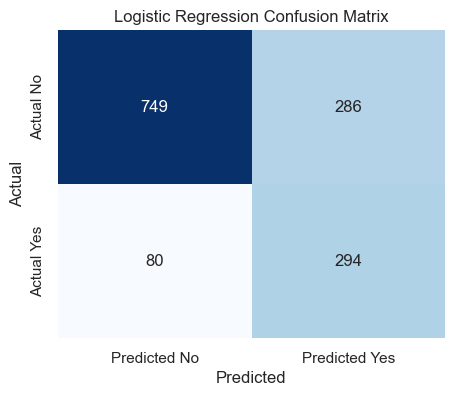

# 📊 Customer Churn Prediction & Retention Strategy System

## 🚀 Project Overview

This project analyzes telecom customer data to understand why customers leave (churn) and predicts which customers are likely to churn.

The goal is to help businesses take **data-driven decisions** to improve customer retention and reduce revenue loss.

---

## 🎯 Objectives

* Identify key factors contributing to customer churn
* Build a machine learning model to predict churn
* Provide actionable retention strategies

---

## 📊 Key Insights

* 📉 Customers on **month-to-month contracts** have the highest churn (~42%)
* ⏳ Customers in their **first 12 months** show the highest churn (~47%)
* 💰 High monthly charges are linked to increased churn

---

## 📈 Key Visualizations

### 🔹 Churn by Contract Type

*Month-to-month customers show significantly higher churn compared to long-term contracts.*

---

### 🔹 Churn by Tenure

*Customers in early tenure (0–12 months) are more likely to churn.*

---

### 🔹 Feature Importance (Random Forest)

*Key drivers include contract type, tenure, and service-related features.*

---

### 🔹 Confusion Matrix

*Model performance showing correct vs incorrect predictions.*

---

## 🤖 Model Performance

| Model               | Accuracy |
| ------------------- | -------- |
| Logistic Regression | 74%      |
| Random Forest       | 78.6%    |

---

## 💡 Business Impact

* Identifies high-risk customers early
* Enables targeted retention strategies
* Helps reduce customer churn and revenue loss

---

## 🛠️ Tech Stack

* Python (Pandas, NumPy)
* Data Visualization (Matplotlib, Seaborn)
* Machine Learning (Scikit-learn)
* Jupyter Notebook

---

## 📂 Project Structure

* `Customer_Churn_Prediction_Retention_Strategy_System.ipynb` → Main notebook
* `images/` → Visualizations used in README

---

## 🚀 Future Improvements

* Hyperparameter tuning to improve accuracy
* Deployment as a web app
* Integration with real-time customer data

---

## 👨‍💻 Author

**Jyoti Basu**
